**Student Name**:  Mohan Dandigam

**NetID**: nj6956

# Homework #2 Solution

## Question 1
### 1(a)

Created clubProject directory.

### 1(b)
(i) Put site wide navigation into the main element?

Answer: No because as per HTML5 Semantic Specifications main element is used to specify main contents of body.

(ii) Should you put common banners (e.g., site logo) in the main element?

Answer: No because as per HTML5 Semantic Specifications common banners can be written under header  tag but not in main tag.

(iii) Should you put copyright notices in the main element?

 Answer: No because as per HTML5 Semantic Specifications copyright notices can be written under footer tag but not in main tag.

FileNames of Pages
1. index.html
2. login.html
3. activities.html

### 1(c)
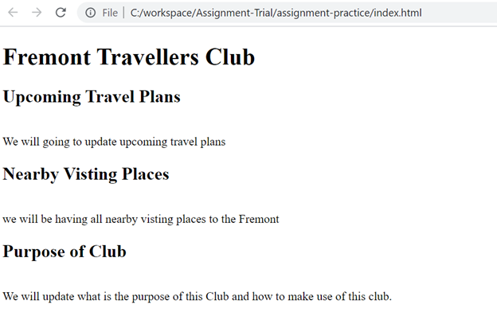
### 1(d)
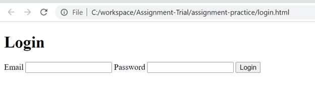
### 1(e)
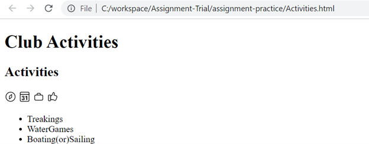
## Question 2
### 2(a)
a )  Should we put header h1 inside or outside the main element according to the specification?

Answer: It is not recomendded to put header under main tag as per HTML5 Semantic Specifications.

### 2(b)

b) Is it okay to put the footer in main ? What about as the last item in the body ? Would you prefer one over the other? Why?

Answer: It is not recomendded to put header under main tag as per HTML5 Semantic Specifications. And last element would be footer of the page. 
I would not prefer to have one over the other as footer shouldn't be inside main as per HTML5 Semantic Specifications.

### 2(c)

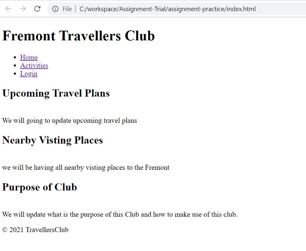

### 2(d)
```HTML Home Page Code
<!DOCTYPE html>
<html lang="en"> <!-- English -->
    <head>
        <title>Fremont Travellers Club</title>
        <link href="club.css" rel="stylesheet">
    </head>
    <!-- I'm an HTML comment -->
    <body> 
        <header>
            <h1> Fremont Travellers Club </h1> 
        </header> 
        <nav>
            <ul>
                <li class="active"><a href="index.html">Home</a></li>
                <li><a href="activities.html">Activities</a></li>
                <li><a href="login.html">Login</a></li>
            </ul>
        </nav>
        <main>
            <p> 
                <h2>Upcoming Travel Plans</h2>
                <br>We will going to update upcoming travel plans
                <br><h2>Nearby Visting Places</h2>
                <br>we will be having all nearby visting places to the Fremont
                <br><h2>Purpose of Club</h2>
                <br>We will update what is the purpose of this Club and how to make use of this club.
            </p>
        </main>
        <footer>
            &#169 2021 TravellersClub
        </footer>
    </body>
</html>
```
## Question 3
### 3(a)
(i) ParseInt is to convert given input to an Integer and NaN is nothing but Not a Number, here we are trying to convert String to Integer so we got NaN as output.

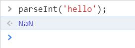

(ii) Bleow method wil convert until first non numeric values. and whenever it encounters a non numeric value it stops parsing.


(iii) Below method will convert binary number into Integer number . Radix 2 indicates given input is in the form of binary.

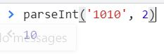

(iii) No its different as it started with non numeric value And thats the reason we got output as NaN.

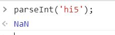


(iv) Put in your name

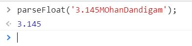

(v) Put in your name


### 3(b)

(i) Use toFixed to get a string of the first 5 digits of pi

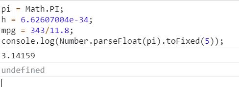

(ii) Use toPrecision to get h (planck's constant) to 3 sig figs

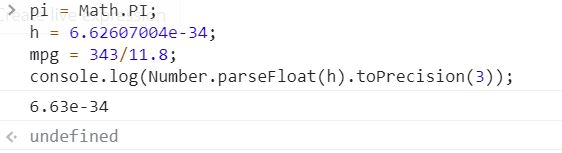

(iii)  Use toFixed to get the mpg to a tenth of a gallon

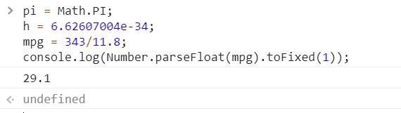

### 3(c)
-> below it printed my name when we given in double qoute.

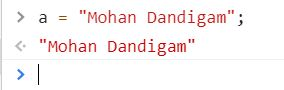

-> below it printed my name when we given in single qoute.

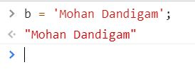


-> Yes Both strings are equal eventhough we declared in  double and single quotes.

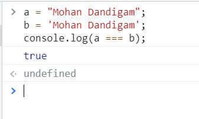

-> Why bother with two string delimiters?

Answer: We use either single quote or double quote based on requirement to pring input alnog with single or doublequoets .For example if a input string contains a single quote then we have to use double quote to declare it .So we can print that single quote as it is along with given input. 

(i) Yes it will work as below becasue we are declare them in double quotes which means it will consider inside single qoute as a string

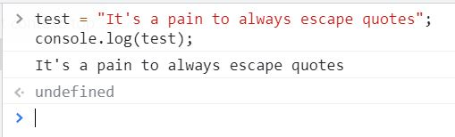

(ii) why not this? below one.

// test = 'It's a pain to always escape quotes'; 
// console.log(test2);

 Answer: we can use quotes inside a string, as long as they don't match the quotes surrounding the string. but in above case both quotes are matching.

(iii) What is going on here..?

Answer: below we have used backslash escape character which turns special characters into string character. so it printed string with single quote as it is.

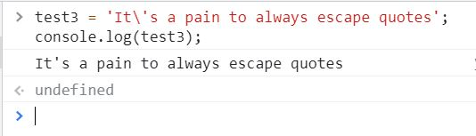

### 3(d)
Converted given String(My Name) to Upper Case

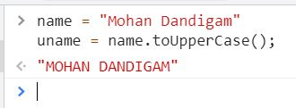

(ii)Converted given String(My Name) to Lower Case

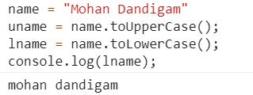

(iii) Explain what the following two lines do.?

Answer: First Line checking whether uname variable having letter 'A' or not as it having A its provided results as True.

Second Line checking whether lname variable having letter 'i' or not as it having i its provided results as True.

### 3(e)

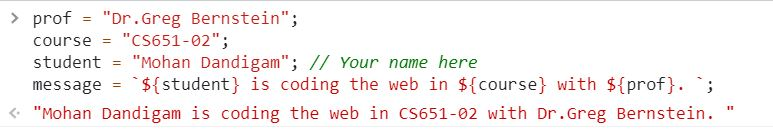

## Question 4
### (a)
(i) what does this do?

 Answer: below function will split given input based on the spaces.

.JPG)

(ii) what do each of these calls do?

Answer: Below calls are pushing or adding data to the given array called myArray.

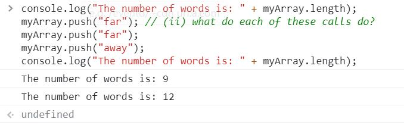

iii) what does join do?

 Answer: below method creates and returns a new string by concatenating symbol(_) for all of the elements in an array where ever space avilable.

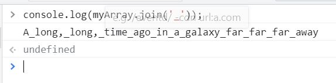

(iv) What does this do?

Answer: Below method will provide index value of element galaxy from  given array called myArray.

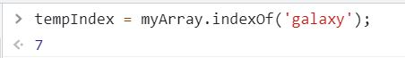

(v) did I change an element?

Answer: Yes. galaxy was changed to college.

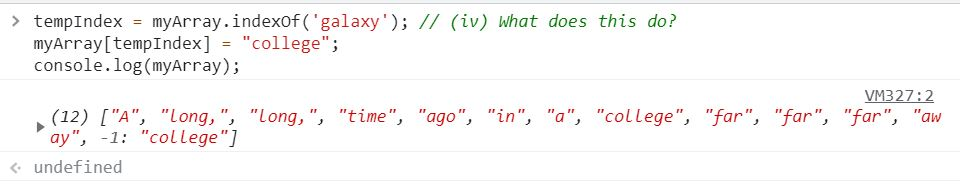

(vi) what does this do?

Answer: it will remove the last element of array and it returns that value. In this case it has removed college.

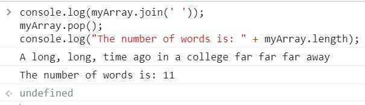
### 4(b)

(i) What does this function do?

 Answer: it will convert the given input to upper case.

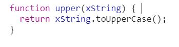

(ii) What does map do?

Answer: Map will return new myArray3 with the upper case array elements of myArray2. as it is calling uppercase functions by passing all myArray2 elements.

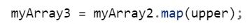

iii) why would I do this?

Answer: In order to sort an array in Javascript we have to first convert all elements of array either to Lowercase or Uppercase if array has elements with mixed cases. As sort function internally convert each string element to UFT code and this code will be different with uppercase and lowercase elements eventhough string element is same.

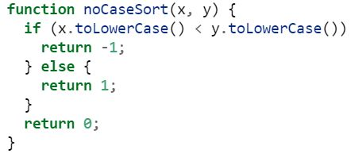

(iv) what is the purpose of passing this function here?

Answer: Usally Javascript Array sort method wont give accurate results if input array has strings with mixed case strings (Upper and Lower cases.). So thats the reason we are passing below noCaseSort funtion to sort method

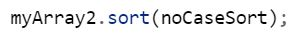

### 4(c)
(i) Why this syntax and not that used for the name field/property

Answer: Because favorite desert property has space in between favourite and desert, so if we use that same as name field we will get error as it wont allow space in property name.

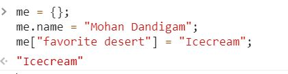

ii) can I put an array in an object?

Answer: Yes,we can put array in object.

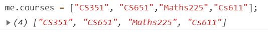

(iii) your favorite number

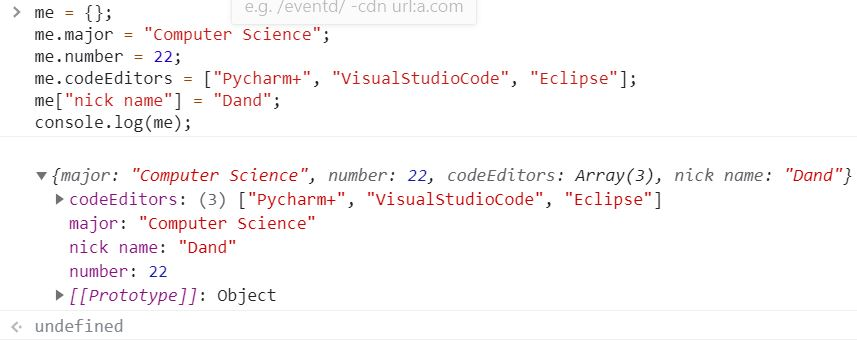

(iv) Put in yours here


## Question 5
### 5(a)
Tell me what font you are using here

Answer: I have used Italic font.

### 5(b)

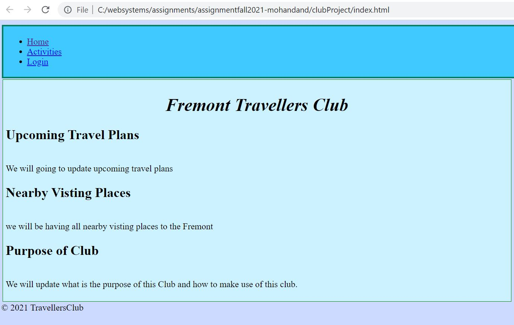

### 5(c)

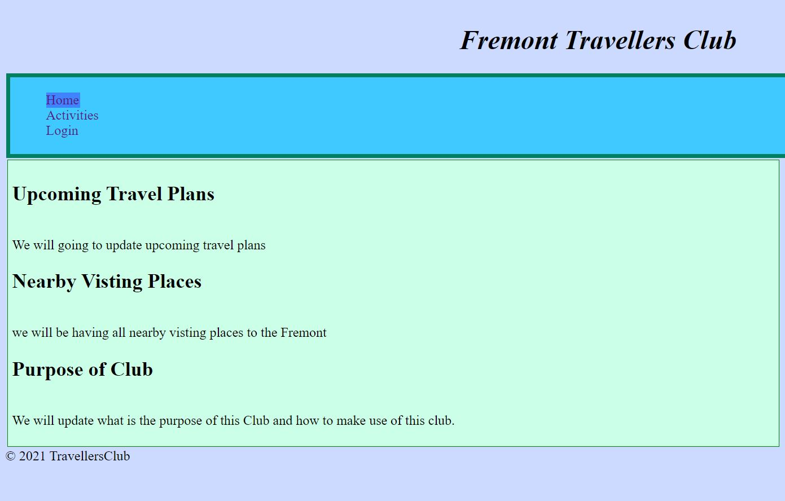

### 5(d)

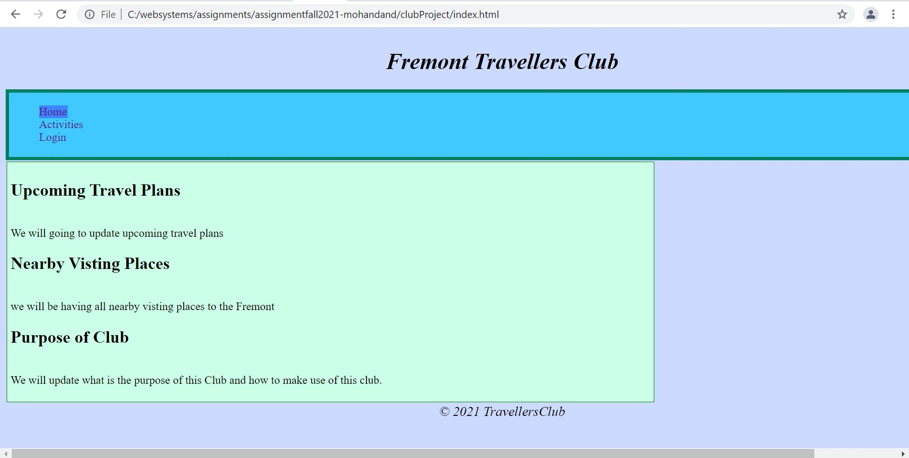