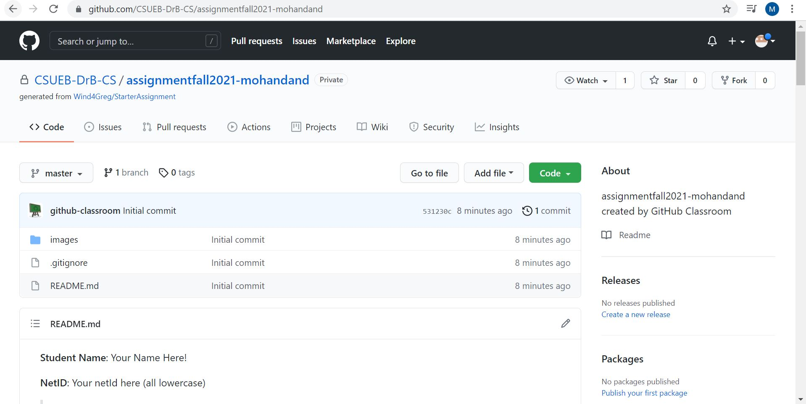
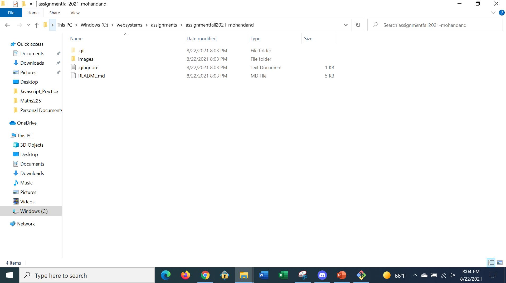
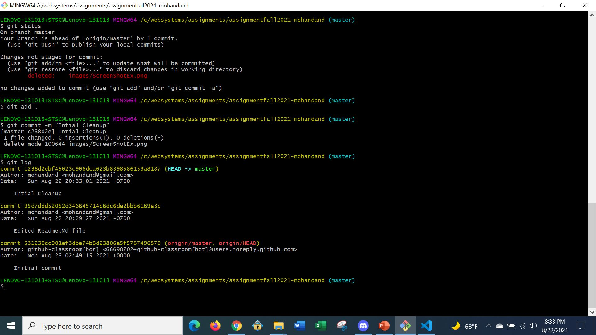
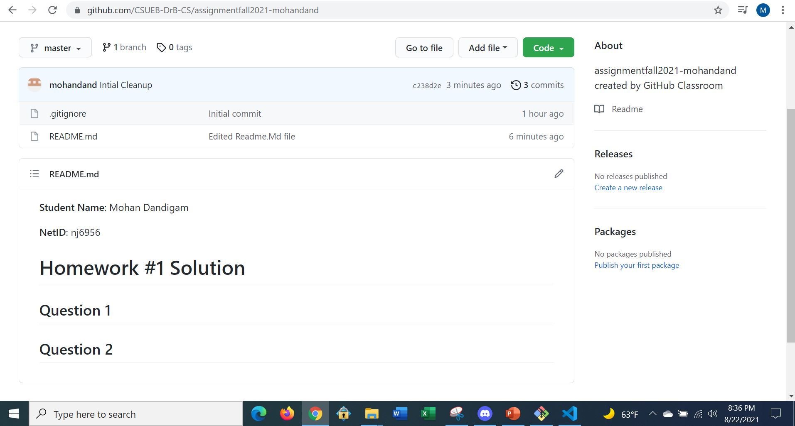

**Student Name**:  Mohan Dandigam

**NetID**: nj6956

# Homework #1 Solution

## Question 1
### (a)



### (b)

## Question 2
### (a)
### (b)

### (c)

## Question 3
### (a)

### (b)

## Question 4
### (a)
1. Java
2. Python
3. Javascript
### (b)
* Windows
* MAC
### (c)
* Eclipse
* Visual Studio Code
## Question 5
### (a)
```javascript
#Java Script Program to find a number Prime or not
var num = 4;
var counter = 0;
for (var i = 1; i <= num; i++) {
    var result = num % i;
    if(result==0) {
        counter = counter +1;
    }
}

if (counter==2{
    console.log('given number is a prime number');
}
else{
    console.log('given number is not an prime');
}

```

### (b)

Visual Studio Code is a lightweight but powerful source code editor which runs on your desktop and is available for Windows, macOS and Linux. [VisualStudioCodeDocumentation](https://code.visualstudio.com/docs).