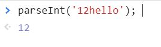
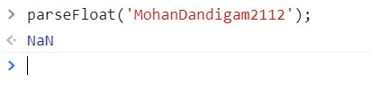

**Student Name**:  Mohan Dandigam

**NetID**: nj6956

# Homework #2 Solution

## Question 1
### 1(a)


### 1(b)

### 1(c)

### 1(d)

### 1(e)

## Question 2
### 2(a)
a )  Should we put header h1inside or outside the <main> element according to the specification?

Answer: We souldn't put header under main tag.

### 2(b)

Is it okay to put the <footer> in <main>? What about as the last item in the <body>? Would you prefer one over the other? Why? Add a <footer> to all your pages containing the copyright symbol 

Answer: We souldn't put footer under main tag and last element would be some contenet of a page.

### 2(c)


### 2(d)
```javascript
#HTML Activites Page
<!DOCTYPE html>
<html lang="en"> <!-- English -->
    <head>
        <title>Activities</title>
        <h1> Club Activities </h1>
    </head>
    <header><h1> Fremont Travellers Club </h1> </header> 
    <!-- I'm an HTML comment -->
    <body>
        <nav>
            <ul>
                    <li><a href="index.html">Home</a></li>
                    <li class="active"><a href="activities.html">Activities</a></li>
                    <li><a href="login.html">Login</a></li>
            </ul>
        </nav> 
        <main>
            <p> <h2>Activities</h2>
                <ul>
                    <li>Treakings</li>
                    <li>WaterGames</li>
                    <li>Boating(or)Sailing</li>
                </ul> 
            </p>
        </main>
    </body>
    <footer>&#169 2021 TravellersClub</footer>
</html>
```
## Question 3
### 3(a)
(i) To convert to Integer and NaN is nothing but Not a Number here we  we are trying to convert String to Integer so we got NaN as output


(ii)Bleow method wil convert until the first alphabet.



(iii) Below method will convert binary number into Integer number


(iii) its different as here it is a sting as it statred with other than number


(iv) No , here input is started with alphabet so it  is provided output as NaN.


(v) it is same as 


### 3(b)

(i) To convert to Integer and NaN is nothing but Not a Number here we  we are trying to convert String to Integer so we got NaN as output


(ii)Bleow method wil convert until the first alphabet.


(iii) Below method will convert binary number into Integer number


### 3(b)
->

->

->

->


(i) To convert to Integer and NaN is nothing but Not a Number here we  we are trying to convert String to Integer so we got NaN as output


(ii)Bleow method wil convert until the first alphabet.


(iii) Below method will convert binary number into Integer number


## Question 4
### (a)
1. Java
2. Python
3. Javascript
### (b)
* Windows
* MAC
### (c)
* Eclipse
* Visual Studio Code
## Question 5
### (a)
```javascript
#Java Script Program to find a number Prime or not
var num = 4;
var counter = 0;
for (var i = 1; i <= num; i++) {
    var result = num % i;
    if(result==0) {
        counter = counter +1;
    }
}

if (counter==2{
    console.log('given number is a prime number');
}
else{
    console.log('given number is not an prime');
}

```

### (b)

Visual Studio Code is a lightweight but powerful source code editor which runs on your desktop and is available for Windows, macOS and Linux. [VisualStudioCodeDocumentation](https://code.visualstudio.com/docs).